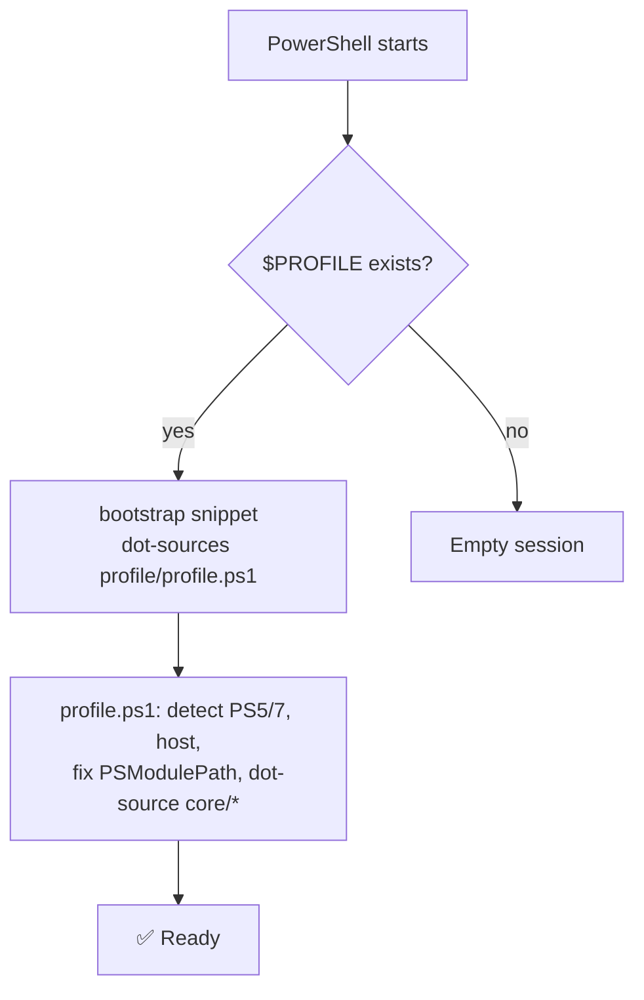

# PowerShell Dotfiles Ecosystem

**Modular, version-controlled PowerShell profile + interactive toolbox — bypasses OneDrive,
auto-detects PS version & host, portable across machines. One repo, one command to install.**

Portal (this repo's GitHub Pages, at the root URL): **[martinpaprcka77.github.io](https://martinpaprcka77.github.io)**

---

## 🚀 Quick Install

```powershell
irm https://raw.githubusercontent.com/martinpaprcka77/martinpaprcka77.github.io/main/remote-install.ps1 | iex
```

From cmd.exe or any shell with a PowerShell host on PATH:
```
powershell -c "irm https://raw.githubusercontent.com/martinpaprcka77/martinpaprcka77.github.io/main/remote-install.ps1 | iex"
```

Or manually, for full parameter parity:
```powershell
git clone https://github.com/martinpaprcka77/martinpaprcka77.github.io.git ~/.config/powershell
~/.config/powershell/install.ps1
# Restart PowerShell → done
```

**Idempotent** — safe to run multiple times. `-WhatIf`/`-Force`/`-NoUpdates`/`-NoTerminal` supported
for direct invocation; `$env:DOTFILES_FORCE`/`$env:DOTFILES_NO_UPDATES`/`$env:DOTFILES_NO_TERMINAL`
for the `irm | iex` one-liner (switches aren't reachable through `iex`).

---

## 📦 Layout

One repo, cloned to `~/.config/powershell/`:

```
~/.config/powershell/
├── install.ps1 · remote-install.ps1 · update.ps1 · bootstrap.ps1
├── index.html · prompts.html          ← this portal (GitHub Pages)
├── .vscode/ · .github/workflows/
├── docs/                              ← ARCHITECTURE, PURPOSE, MANUAL, ROADMAP, PROMPT
│
├── profile/                           ← profile orchestration
│   ├── profile.ps1                    ← main orchestrator
│   ├── core/                          ← aliases · functions · env · diag · perf · status
│   ├── ps5/ · ps7/                    ← version-specific
│   ├── hosts/                         ← ConsoleHost · VSCode · wtprofile · shell-integration
│   └── lib/                           ← output · paths (Known-Folder-correct) · bootstrap
│
└── toolkit/                           ← interactive toolbox
    ├── bin/                           ← menu.ps1 · check.ps1 (in PATH)
    ├── Toolkit/                       ← PowerShell module (37 functions)
    ├── lib/                           ← menu engine · checkers · config · detectors · modulepath
    ├── menu/                          ← 7 submenu definitions
    ├── scripts/                       ← deps · windows · modernize · precheck · Add-WTProfiles · configure
    ├── configs/ · tests/
```

`$env:DOTFILES_PWSH` points at `profile/`; `$env:DOTFILES_TOOLS` is derived from it as a sibling
`toolkit/` directory — always in sync, no separate source of truth.

---

## 🧩 How It Works



Full sequence and component diagrams: [docs/ARCHITECTURE.md](docs/ARCHITECTURE.md).

---

## ⌨️ Quick Commands

| Command | What it does |
|---------|---------------|
| `menu` | Interactive TUI menu — arrow keys, live status detection per item |
| `check` | Full system diagnostics (disks, services, network, processes) |
| `status` | Global health dashboard (`Show-Status`, 20+ checks) |
| `update` | Git pull latest + self-heal bootstrap + reload profile |
| `configure` | Interactive setup wizard |
| `ep` / `rp` | Edit / reload profile |

Full command reference: [docs/MANUAL.md](docs/MANUAL.md).

---

## 📖 Docs

| Document | Description |
|----------|-------------|
| [docs/ARCHITECTURE.md](docs/ARCHITECTURE.md) | Mermaid UML diagrams — loading sequence, component map, install flow |
| [docs/PURPOSE.md](docs/PURPOSE.md) | Why this exists, design decisions |
| [docs/MANUAL.md](docs/MANUAL.md) | Full user guide |
| [docs/ROADMAP.md](docs/ROADMAP.md) | Phases, known issues, contribution guide |
| [docs/PROMPT.md](docs/PROMPT.md) | Original AI prompts that generated this project |
| [AGENTS.md](AGENTS.md) | Full AI agent guide |
| [CLAUDE.md](CLAUDE.md) | Claude memory file |
| [prompts.html](https://martinpaprcka77.github.io/prompts.html) | AI prompt templates for working on this repo |

---

## 🔗 Links

| Resource | URL |
|----------|-----|
| **Repo / Portal** | [github.com/martinpaprcka77/martinpaprcka77.github.io](https://github.com/martinpaprcka77/martinpaprcka77.github.io) |
| **Gist: Install** | [gist.github.com/…/bafc2457](https://gist.github.com/martinpaprcka77/bafc2457fd9d93daf1b1b69c348e0cfd) |
| **Gist: Cheatsheet** | [gist.github.com/…/b30ae16](https://gist.github.com/martinpaprcka77/b30ae161dfb693431a438e309f236467) |
| **Gist: Master prompt** | [gist.github.com/…/master-prompt](https://gist.github.com/martinpaprcka77/1c74223f4e57b46977abd6df06d4e8fd) |

Previously split across two repos (`dotfiles-powershell`, `dotfiles-tools`) — merged into this
one to eliminate cross-repo coupling. Those repos remain on GitHub with a pointer to this one;
see [docs/ROADMAP.md](docs/ROADMAP.md) for the full rationale.
