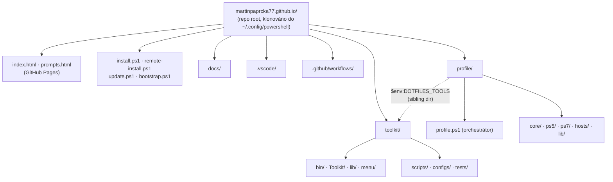
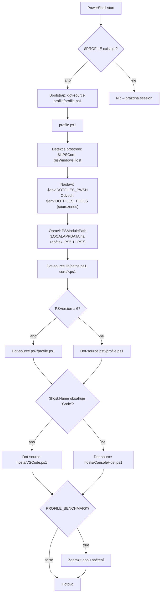
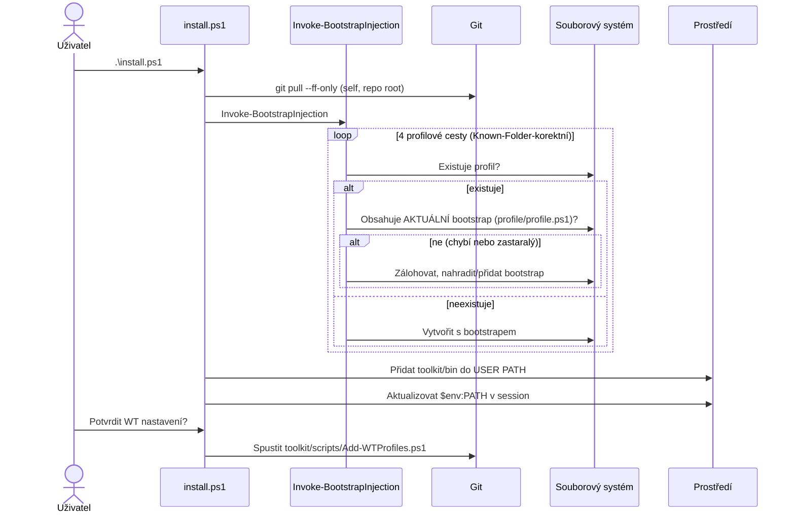
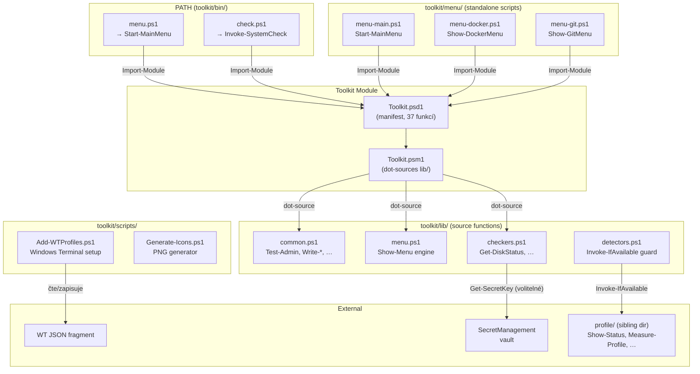
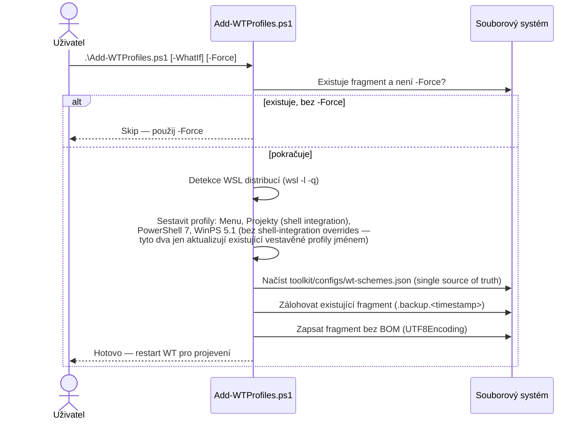
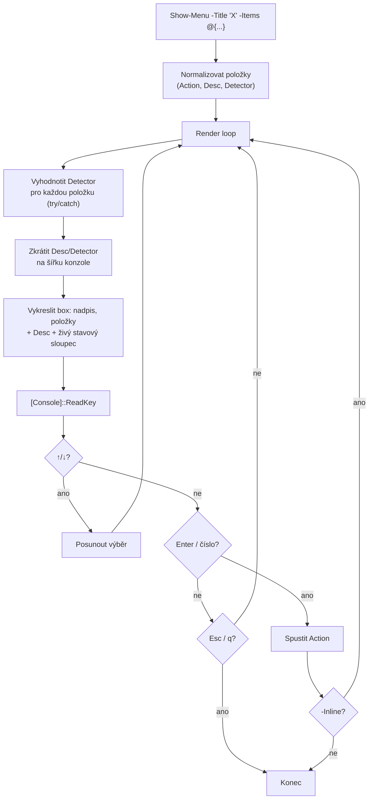
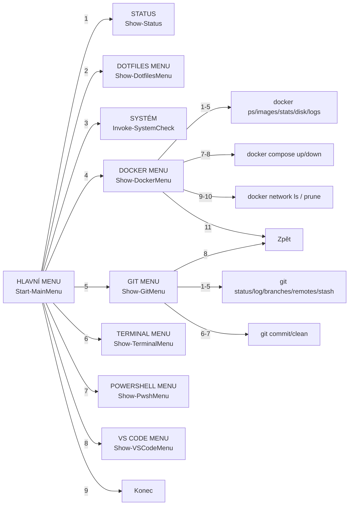

# Architektura

Ekosystém žije v jednom repozitáři (`martinpaprcka77.github.io`) se dvěma hlavními
podadresáři — `profile/` (orchestrace profilu) a `toolkit/` (interaktivní nástroje) — plus
`site/` obsah (`index.html`, `prompts.html`) pro GitHub Pages na kořenové URL.

## Monorepo layout



`$env:DOTFILES_PWSH` (nastaveno `profile.ps1`) ukazuje na `profile/`; `$env:DOTFILES_TOOLS`
se z něj odvozuje jako sourozenecký adresář `toolkit/` — obě proměnné jsou tedy vždy v souladu
(dřív, ve dvou repozitářích, šlo o dva nezávislé zdroje pravdy, které se mohly rozejít).

## Diagram načítání profilu



## Mapa proměnných prostředí

| Proměnná | Nastavuje | Hodnota | Použití |
|----------|-----------|---------|---------|
| `$env:DOTFILES_PWSH` | `profile.ps1` | `~/.config/powershell/profile` | Cesta k profilové části |
| `$env:DOTFILES_TOOLS` | `profile.ps1` / `core/env.ps1` | `~/.config/powershell/toolkit` | Cesta k toolkit části (sourozenec `DOTFILES_PWSH`) |
| `$env:EDITOR` | `core/env.ps1` | `code` / `nvim` / `vim` / `notepad` | Výchozí editor |
| `$env:PROFILE_BENCHMARK` | Uživatel | `true` / (prázdné) | Měření doby načtení |
| `$env:TERM` | `hosts/VSCode.ps1` | `vscode` | Indikátor VS Code terminálu |
| `$env:PSModulePath` | `profile.ps1` (PS5.1 i PS7) | + `%LOCALAPPDATA%\...\Modules` | Oprava OneDrive |

## Flow instalace (install.ps1)



`update.ps1` volá `Invoke-BootstrapInjection` po každém pullu (bez `-Force`) — pokud je
existující bootstrap na starou (pre-monorepo) cestu, automaticky se opraví, aniž by uživatel
musel vědět, že má znovu spustit `install.ps1`.

## Detekce verze a hostitele

```powershell
# Verze PowerShellu
if ($PSVersionTable.PSVersion.Major -ge 6) { "ps7" } else { "ps5" }

# Hostitel
if ($host.Name -match 'Code') { 'VSCode' } else { 'ConsoleHost' }
```

---

## Toolkit — komponentový diagram



## Datový tok: Add-WTProfiles.ps1

Reálná implementace **negeneruje settings.json editaci ani neodstraňuje `//` komentáře** — to
byl starší návrh. Od WT 1.24+ se používá **JSON fragment extension**
(`%LOCALAPPDATA%\Microsoft\Windows Terminal\Fragments\dotfiles\dotfiles.json`), kterou WT čte
automaticky bez zásahu do uživatelova `settings.json`. Profily se párují podle `name`, ne GUID —
žádné GUID se nikde negenerují ani nepoužívají.



## Menu engine (Show-Menu)

Skutečná implementace používá **arrow-key navigaci přes `[Console]::ReadKey`**, ne číslované
`Read-Host` vstupy (číselné zkratky fungují taky, jako doplněk). Každá položka může nést
volitelný `Detector` scriptblock, který se vyhodnotí znovu při každém překreslení a zobrazí
živý stavový sloupec (✅/⚠️/❌ + text) vedle popisu. Šířka boxu je ořezána na
`[Console]::WindowWidth`; příliš dlouhý `Desc`/`Detector` text se zkrátí s výpustkou (`…`),
aby dlouhá zpráva nezalomila řádek a nerozbila rámeček.



## Hierarchie menu



## Vztah bin/ ↔ Toolkit ↔ lib/

```
toolkit/bin/menu.ps1          toolkit/bin/check.ps1
    │                           │
    │ Import-Module             │ Import-Module
    ▼                           ▼
┌─────────────────────────────────────────┐
│           Toolkit.psd1 (manifest)       │
│  FunctionsToExport: 37 functions         │
└─────────────────────────────────────────┘
    │
    │ RootModule
    ▼
┌─────────────────────────────────────────┐
│           Toolkit.psm1 (module)         │
│  dot-sources all lib/*.ps1               │
│  Export-ModuleMember -Function @(...)    │
└─────────────────────────────────────────┘
    │
    │ dot-source
    ▼
┌────────────┐ ┌────────────┐ ┌──────────────┐
│ common.ps1 │ │ menu.ps1   │ │ checkers.ps1  │
└────────────┘ └────────────┘ └──────────────┘
```

## Profily Windows Terminal (fragment extension, párováno jménem)

Žádné GUID — WT fragment extensions párují profily podle `name`. `Menu`/`Projekty` jsou nové
vlastní profily (shell integration povolena). `PowerShell 7`/`Windows PowerShell 5.1` **aktualizují
existující vestavěné profily stejného jména** — záměrně jen o `icon`/`tabTitle`, nikdy o
font/colorScheme/shell-integration, aby se tiše nepřepsalo uživatelovo vlastní nastavení.

| Profil | Typ | Příkaz |
|--------|-----|--------|
| Menu | nový, vlastní | `pwsh.exe` → `toolkit/menu/menu-main.ps1` |
| Projekty | nový, vlastní | `pwsh.exe` → `~/Projects/work` |
| PowerShell 7 | update vestavěného | `pwsh.exe` → `~` |
| Windows PowerShell 5.1 | update vestavěného | `powershell.exe` → `~` |
| WSL: `<distro>` | auto-detekováno (`wsl -l -q`) | `wsl.exe -d <distro>` |
