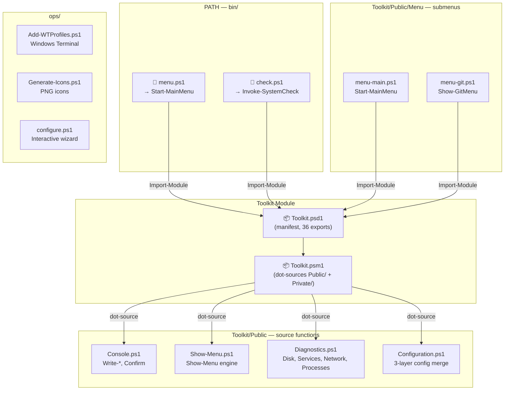
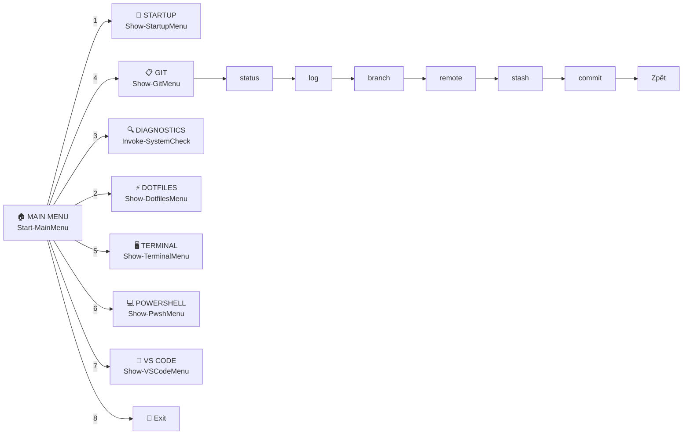

# dotfiles-tools (toolkit)

> **Part of the [`martinpaprcka77.github.io`](https://github.com/martinpaprcka77/martinpaprcka77.github.io) monorepo.**
> This toolkit lives in the
> [`toolkit/`](https://github.com/martinpaprcka77/martinpaprcka77.github.io/tree/main/toolkit)
> folder; the standalone `dotfiles-tools` repo is superseded by it.

> **PowerShell toolbox** — interactive menus with live status detection, system diagnostics, Git helpers, Toolkit module with 36 functions.

[](#)
[](#)
[](#)
[](#)
[](#)

---

## 🔗 Repo Boundary

| Companion repo (`dotfiles-powershell`) | This repo (`dotfiles-tools`) |
|----------------------------------------|-------------------------------|
| `~/.config/powershell/` | `~/Projects/tools/` |
| Profile orchestration | Menu & diagnostics |
| Bootstrap & install | Toolkit PowerShell module |
| Version/host profiles | Windows Terminal integration |
| Secret management helpers | Pester tests (69 cases) |
| 👉 **[github.com/martinpaprcka77/dotfiles-powershell](https://github.com/martinpaprcka77/dotfiles-powershell)** | 👉 **[github.com/martinpaprcka77/martinpaprcka77.github.io/tree/main/toolkit](https://github.com/martinpaprcka77/martinpaprcka77.github.io/tree/main/toolkit)** |
| **🌐 Portal: [martinpaprcka77.github.io](https://martinpaprcka77.github.io)** | |

---

## 📊 Summary

| What | Details |
|------|---------|
| **Location** | `~/Projects/tools/` |
| **36 functions** | Toolkit module — menu engine, live-status detectors, diagnostics, utilities, logging, config, modulepath |
| **2 bin scripts** | `menu.ps1`, `check.ps1` |
| **7 menus** | Main, Startup, Git, Terminal, Dotfiles, Pwsh, VSCode (numbered, extensible, live per-item status) |
| **8 helper scripts** | Add-WTProfiles, Generate-Icons, configure, deps, windows, modernize, precheck, Get-PowerShellStartupHealth |
| **69 Pester tests** | Module structure, function exports, Mock coverage, config, error paths, PSModulePath |

---

## 🧩 Architecture (UML)



### Menu Hierarchy



---

## 🚀 Quick Start

```powershell
# Clone the monorepo; the toolkit is the toolkit/ folder inside it.
git clone https://github.com/martinpaprcka77/martinpaprcka77.github.io.git
cd martinpaprcka77.github.io/toolkit
# Requires dotfiles-powershell installed first!

# After install (bin/ is in PATH):
menu          # interactive main menu
check         # system diagnostics

# Or directly:
Import-Module ~/Projects/tools/Toolkit/Toolkit.psd1
Start-MainMenu
Invoke-SystemCheck
```

---

## 📦 Toolkit Module — 36 Functions

> Full, generated inventory (grouped by concern, with counts): **[docs/20-reference.md](docs/20-reference.md)**. Regenerate with `pwsh -File build/Generate-Docs.ps1`.

| Category | Function | Purpose |
|----------|----------|---------|
| **Menu** | `Start-MainMenu` | Main interactive menu (7 items) |
| | `Show-GitMenu` | Git operations |
| | `Show-TerminalMenu` | WT profiles, schemes, fonts, shell integration |
| | `Show-DotfilesMenu` | Install, update, backup, restore, clean |
| | `Show-PwshMenu` | Profile edit, reload, benchmark, performance |
| | `Show-VSCodeMenu` | VS Code settings, tasks, agent, extensions |
| | `Show-Menu` | Generic arrow-key menu engine |
| **Diagnostics** | `Invoke-SystemCheck` | Full system health check |
| | `Get-DiskStatus` | Disk space & usage |
| | `Get-ServiceStatus` | Key services (WinRM, W3SVC, …) |
| | `Get-NetworkInfo` | IP addresses & interfaces |
| | `Get-TopProcesses` | Top 10 by CPU |
| **Utility** | `Confirm-Action` | Y/N prompt |
| **Logging** | `Write-Info` / `Write-Success` | Info & success messages |
| | `Write-Warn` / `Write-Err` | Warning & error messages |
| **Config** | `Get-ToolkitConfig` | Merge defaults + JSON + env |
| | `Save-ToolkitConfig` | Save config to disk |
| | `Merge-Hashtable` | Deep merge two hashtables |
| **PSModulePath** | `Get-PSModulePath` | List entries with validation status |
| | `Add-PSModulePath` | Add a path (no duplicates) |
| | `Remove-PSModulePath` | Remove a path by index or value |
| | `Reset-PSModulePath` | Reset to modern baseline |
| | `Export-PSModulePath` | Save current paths to JSON |
| | `Import-PSModulePath` | Restore paths from JSON |
| | `Test-PSModulePath` | Validate (duplicates, missing dirs, OneDrive, priority) |
| **Detectors** | `Get-ModuleStackStatus` | Show-Menu live status: legacy vs. modern module stack |
| | `Test-LegacyPowerShellGetPresent` | Detector predicate: legacy module present? |
| | `Test-PSResourceGetReady` | Detector predicate: PSResourceGet available? |
| | `Get-ModulePathStatus` | Show-Menu live status: PSModulePath health |

---

## 📂 Files

```
~/Projects/tools/
├── build/                    ← Generate-Docs.ps1 (regenerates docs/20-reference.md)
├── bin/
│   ├── menu.ps1              ← launch main menu
│   └── check.ps1             ← system diagnostics
├── Toolkit/                  ← PowerShell module (self-contained)
│   ├── Toolkit.psd1          ← module manifest (33 exports — the only export list)
│   ├── Toolkit.psm1          ← loader (dot-sources Private/ + Public/)
│   ├── Private/
│   │   └── Get-ToolkitRoot.ps1 ← repo-root resolver (never exported)
│   └── Public/
│       ├── Console.ps1       ← Write-Info/Success/Warn/Err, Confirm-Action
│       ├── Configuration.ps1 ← 3-layer config (defaults → JSON → env)
│       ├── Diagnostics.ps1   ← disk, services, network, processes (local-only)
│       ├── Detectors.ps1     ← Show-Menu live-status detectors
│       ├── ModulePath.ps1    ← PSModulePath manager
│       ├── Output.ps1        ← Write-TkMessage — single logging source
│       ├── Show-Menu.ps1     ← Show-Menu engine (arrow-key nav + live status column)
│       └── Menu/             ← submenus (standalone or via module)
│           ├── menu-main.ps1     ← Start-MainMenu
│           ├── menu-startup.ps1  ← Show-StartupMenu — bootstrap process stages
│           ├── menu-git.ps1      ← Show-GitMenu
│           ├── menu-terminal.ps1 ← Show-TerminalMenu
│           ├── menu-dotfiles.ps1 ← Show-DotfilesMenu
│           ├── menu-pwsh.ps1     ← Show-PwshMenu
│           └── menu-vscode.ps1   ← Show-VSCodeMenu
├── ops/
│   ├── Add-WTProfiles.ps1    ← WT fragment generator (3 profiles + schemes)
│   ├── Generate-Icons.ps1    ← PNG icon generator
│   ├── configure.ps1         ← interactive config wizard
│   ├── deps.ps1              ← winget dependency installer
│   ├── windows.ps1           ← Windows defaults (Explorer, privacy)
│   ├── Get-PowerShellStartupHealth.ps1 ← local-only startup health JSON (for PowerShell-Startup-Map.html)
│   └── precheck.ps1          ← 20+ inventory checks
├── config/
│   ├── settings.example.json ← committed template — copy to settings.json to customise
│   │                            (settings.json itself is LOCAL + gitignored; Save-ToolkitConfig
│   │                            and ops/configure.ps1 write it, so the wizard cannot dirty the tree)
│   └── wt-schemes.json       ← WT color schemes (single source of truth, read by Add-WTProfiles.ps1)
├── tests/Toolkit.Tests.ps1   ← 73 Pester test cases (70 module/behaviour + 3 repo invariants)
├── docs/                     ← ordered by the bootstrap lifecycle (00 → 90)
└── .gitignore
```

---

## 📖 Docs

| Document | Description |
|----------|-------------|
| [00-bootstrap.md](docs/00-bootstrap.md) | PS7 startup phases 0–8 (taxonomy), edge cases, ASCII poster + Mermaid flows, dark clickable decision tree, command cheat sheet |
| [PowerShell-Startup-Map.html](PowerShell-Startup-Map.html) | **Interactive** 5-lane startup health map — green/yellow/red from the collector JSON |
| [10-architecture.md](docs/10-architecture.md) | Mermaid diagrams — components, WT sequence, menu engine, hierarchy, dependency chain |
| [20-reference.md](docs/20-reference.md) | **Generated** API inventory — functions by concern, counts, invariants |
| [30-manual.md](docs/30-manual.md) | User guide — every script with examples |
| [40-roadmap.md](docs/40-roadmap.md) | Phases — completed, planned, known issues |
| [90-prompt.md](docs/90-prompt.md) | Original AI prompt |

---

## 🧪 Tests

```powershell
Install-Module Pester -Force
Invoke-Pester ~/Projects/tools/tests/Toolkit.Tests.ps1

# full gate: manifest parity + Pester + PSScriptAnalyzer
pwsh -File build/Test.ps1
```

**69 test cases**: module structure, function exports, utility behavior with Mocks, config env-var overrides, menu error paths, system check mocks, PSModulePath management. The suite targets Windows + PowerShell 7.

---

## 🏷️ Companion Repo

The **dotfiles-powershell** repo provides the profile orchestration, install/bootstrap, and secret management:  
👉 **[github.com/martinpaprcka77/dotfiles-powershell](https://github.com/martinpaprcka77/dotfiles-powershell)**
