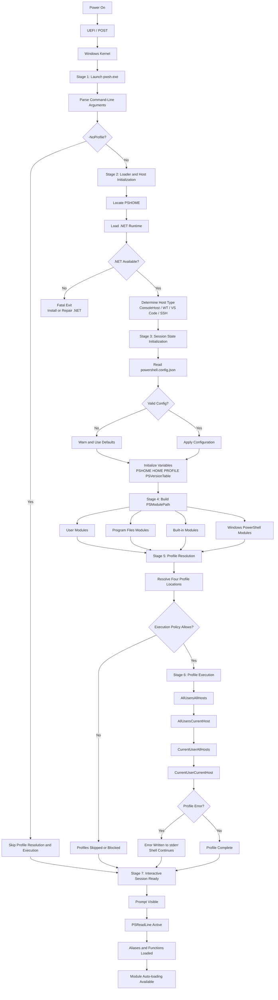
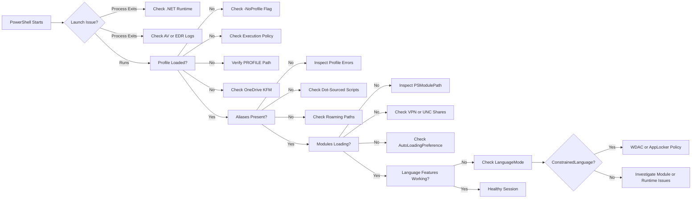
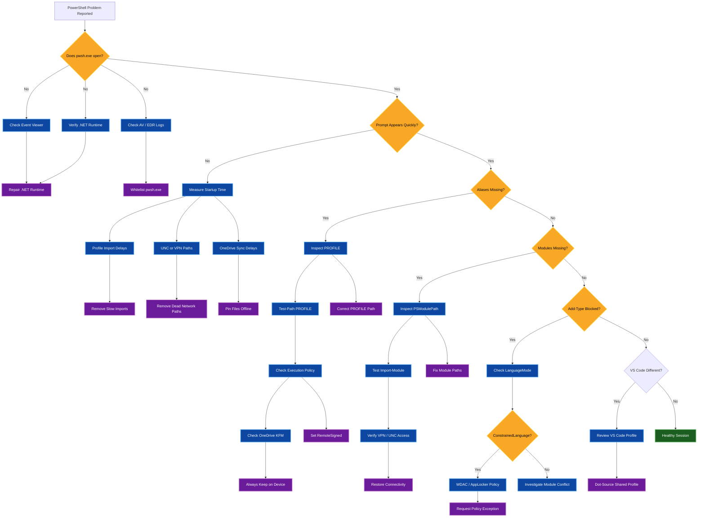
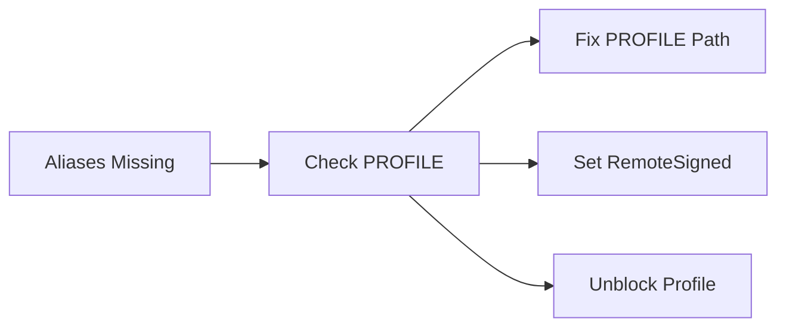

# 00 — PowerShell 7 bootstrap lifecycle (Windows 11)

> Scope: how a `pwsh.exe` session is born and configured, stage by stage, and the
> edge cases that silently hijack it. This is the host environment the toolbox runs
> **inside** — it is not this repo's own control flow. Read it first so the later
> docs (architecture, reference) have a frame.
>
> Local-only: every diagnostic in this repo observes this flow with local checks;
> nothing here reaches the network.
>
> **Live map:** [`../PowerShell-Startup-Map.html`](../PowerShell-Startup-Map.html) renders these
> stages as a green/yellow/red health dashboard (5 lanes, live). Feed it JSON from
> `ops/Get-PowerShellStartupHealth.ps1`.

## Stage taxonomy — the terms are not interchangeable

People say "bootstrap", "launcher", "loader", "host init", and "engine init"
as if they were the same thing. They are not — each is a distinct phase, owned by
a different actor, and that distinction is what lets you place a failure in the
exact subsystem that caused it.

| Term | What it actually means | Owned by |
|------|------------------------|----------|
| **OS bootstrap** | UEFI → Windows Boot Manager → kernel → Terminal/login | Windows, *not* PowerShell |
| **Launcher** | `pwsh.exe` parses switches (`-NoProfile`, `-File`, `-Command`), selects host, resolves its own path | PowerShell |
| **Loader** | Locate `$PSHOME`; load hostfxr → .NET runtime/CLR → `System.Management.Automation.dll` | pwsh host process |
| **Host initialization** | Create the runspace host (ConsoleHost / WT / VS Code / SSH) and its streams | host |
| **Engine bootstrap** | Create `SessionState`, register cmdlets, load providers, set automatic variables (`$PSHOME` `$PROFILE` `$HOME` `$PID` `$PSVersionTable`), execution policy | PowerShell engine |
| **Configuration bootstrap** | Read `powershell.config.json`, GPO, WDAC/AppLocker → `LanguageMode` | OS policy + engine |
| **Module bootstrap** | Build `PSModulePath`, register locations, enable auto-loading | engine |
| **Profile bootstrap** | Resolve and run the four `$PROFILE` tiers | user code |
| **Interactive initialization** | Enable auto-loading, start PSReadLine, show prompt, wait for input | engine + user |

## Canonical phases (0–8) and the five lanes

The poster's five lanes are a *presentation* grouping; the canonical model has
nine phases. Lane 2 holds both Loader and Host; lane 3 holds Engine and
Configuration; lane 4 holds Module and Profile.

| Phase | Mapped lane | Checkpoint | Silent skip? | Where this repo acts |
|-------|-------------|-----------|:---:|----------------------|
| 0. OS bootstrap (UEFI → kernel → Terminal) | *(before Lane 1)* | power on | — | *(Windows)* |
| 1. Launcher | **Lane 1 — Launcher** | `$PID` | no | `ops/Add-WTProfiles.ps1`, `Toolkit/Public/Menu/menu-terminal.ps1` |
| 2. Loader | **Lane 2 — Loader & Host** | `$PSVersionTable` | no (fatal) | *(host)* |
| 3. Host initialization | **Lane 2 — Loader & Host** | `$Host` | no | *(host / companion)* |
| 4. Engine bootstrap | **Lane 3 — Engine & Session State** | `$ExecutionContext` | yes | `ops/precheck.ps1` (observes) |
| 5. Configuration bootstrap | **Lane 3 — Engine & Session State** | `LanguageMode` | yes | `ops/precheck.ps1` (observes) |
| 6. Module bootstrap | **Lane 4 — Profiles & Modules** | `$env:PSModulePath` | yes | `Toolkit/Public/ModulePath.ps1` (`Get/Add/Remove/Reset/Export/Import/Test-PSModulePath`) |
| 7. Profile bootstrap | **Lane 4 — Profiles & Modules** | `$PROFILE` | yes | `Toolkit/Public/Menu/menu-dotfiles.ps1` (backup/restore), `ops/precheck.ps1` (observes) |
| 8. Interactive initialization | **Lane 5 — Interactive Shell** | `Get-Command` | yes | this repo's menus + diagnostics |

> The **silent-skip** column is the important one: phases 2–3 fail *loudly* (the
> process dies), but phases 4–8 fail *quietly* — PowerShell finishes booting
> **degraded** and you only notice when a specific alias or module is missing.

### Complete mapping

```text
WINDOWS BOOTSTRAP (phase 0)
│
├─ UEFI / POST
├─ Windows Kernel
└─ User launches pwsh.exe

POWERSHELL BOOTSTRAP
│
├─ 1. Launcher
│    ├─ Parse arguments
│    ├─ Select host
│    └─ Resolve executable
│
├─ 2. Loader
│    ├─ Locate PSHOME
│    ├─ Load .NET
│    └─ Load assemblies
│
├─ 3. Host Initialization
│    ├─ Create ConsoleHost
│    └─ Create Runspace
│
├─ 4. Engine Bootstrap
│    ├─ SessionState
│    ├─ Variables
│    └─ Providers
│
├─ 5. Configuration Bootstrap
│    ├─ Config JSON
│    ├─ GPO
│    └─ WDAC / AppLocker
│
├─ 6. Module Bootstrap
│    └─ Build PSModulePath
│
├─ 7. Profile Bootstrap
│    └─ Execute profile files
│
└─ 8. Interactive Initialization
     ├─ PSReadLine
     ├─ Prompt
     └─ Ready
```

> **Numbering note:** the poster and Mermaid flows below use the coarse
> **7-stage PowerShell** numbering (Host folded into Loader; Engine +
> Configuration under Session State; Module + Profile merged). The canonical
> **0–8** table above is the finer breakdown. The two map by *name*, not number.

```text
╔══════════════════════════════════════════════════════════════════════════════╗
║          PowerShell 7 Bootstrap — Windows 11  (with edge cases)              ║
╚══════════════════════════════════════════════════════════════════════════════╝

   ┌──────────────┐
   │  Power On    │
   └──────┬───────┘
          ▼
   ┌──────────────┐      ⚠ EDGE: Fast Startup can skip a real cold boot;
   │ UEFI / POST  │         stale driver state persists between "shutdowns".
   └──────┬───────┘
          ▼
   ┌──────────────┐
   │  Windows     │
   │  Kernel      │
   └──────┬───────┘
          ▼
╔══════════════════════════════════════════════════════════════════════════════╗
║ STAGE 1 ── LAUNCH  (user runs pwsh.exe / Windows Terminal / VS Code)         ║
╚══════════════════════════════════════════════════════════════════════════════╝
          │
          ▼
   ┌─────────────────────────┐
   │ Parse command-line args │
   └──────┬──────────────────┘
          │
    ┌─────┴──────┬───────────┬────────────┬──────────────┐
    ▼            ▼           ▼            ▼              ▼
 -NoProfile  -NoLogo    -Command      -File         (no flag)
    │            │           │            │              │
    │            │           │            │              │
    └────────────┴───────────┴────────────┴──────┬───────┘
                                                 ▼
  ⚠ EDGE: -NoProfile skips STAGE 5 & 6 entirely  │
     → aliases/modules from profile NEVER load   │
                                                 ▼
╔══════════════════════════════════════════════════════════════════════════════╗
║ STAGE 2 ── LOADER / HOST INIT                                                ║
╚══════════════════════════════════════════════════════════════════════════════╝
          │
          ▼
   ┌─────────────────────────┐
   │ Locate $PSHOME          │   default: C:\Program Files\PowerShell\7
   │ (pwsh.exe directory)    │
   └──────┬──────────────────┘
          │
    ┌─────┴───────────────────────────┬──────────────────────────┐
    ▼                                 ▼                          ▼
 x64 install                    ARM64 install              x86 (32-bit)
    │                                 │                          │
    └─────────────┬───────────────────┴──────────────┬───────────┘
                  ▼                                  ▼
        ┌──────────────────┐              ⚠ EDGE: "Side-by-side"
        │ Load .NET 8+     │                 installs — pwsh may pick
        │ runtime          │                 the WRONG $PSHOME if PATH
        └────────┬─────────┘                 has multiple entries.
                 │
    ┌────────────┴─────────────┐
    ▼                          ▼
 ✓ .NET present            ✗ .NET missing / corrupted
    │                          │
    │                          ▼
    │                  ┌─────────────────────────────┐
    │                  │ FATAL: pwsh.exe exits       │
    │                  │ "You must install .NET"     │
    │                  └─────────────────────────────┘
    ▼
   ┌──────────────────────────┐
   │ Determine host type      │  ConsoleHost / Windows Terminal / VS Code
   │ Create host window       │  / ISE-host / remote SSH
   └────────┬─────────────────┘
            │
   ⚠ EDGE: Antivirus / EDR blocks pwsh.exe on first launch
      → process killed before SessionState init, no error dialog

╔══════════════════════════════════════════════════════════════════════════════╗
║ STAGE 3 ── SESSION STATE INIT  (checks + environment)                        ║
╚══════════════════════════════════════════════════════════════════════════════╝
            │
            ▼
   ┌────────────────────────────┐
   │ Read powershell.config.json│
   └─────┬──────────────────────┘
         │
   ┌─────┴─────────┬──────────────┬─────────────────┐
   ▼               ▼              ▼                 ▼
 ✓ Valid        ✗ Malformed     GPO overrides    WDAC / AppLocker
   │            JSON            config           policy present
   │               │              │                 │
   │               ▼              ▼                 ▼
   │        ┌───────────┐  ┌────────────┐  ┌──────────────────────┐
   │        │ Warn +    │  │ Config     │  │ LanguageMode forced  │
   │        │ use       │  │ IGNORED,   │  │ to ConstrainedLanguage│
   │        │ defaults  │  │ GPO wins   │  │ → Add-Type, [Ref],   │
   │        └───────────┘  └────────────┘  │   COM, .NET types    │
   │                                       │   BLOCKED            │
   │                                       └──────────────────────┘
   ▼
   ┌────────────────────────────┐
   │ Set automatic variables    │
   │  $PSHOME  $HOME  $PROFILE  │
   │  $PSVersionTable           │
   └─────┬──────────────────────┘
         │
         ▼
╔══════════════════════════════════════════════════════════════════════════════╗
║ STAGE 4 ── $env:PSModulePath  BUILD                                          ║
╚══════════════════════════════════════════════════════════════════════════════╝
         │
         ▼
   ┌──────────────────────────────────────────────────────────────┐
   │ Default module search paths (semicolon-separated):            │
   │                                                               │
   │  1. C:\Users\<user>\Documents\PowerShell\Modules              │
   │  2. C:\Program Files\PowerShell\Modules                       │
   │  3. C:\Program Files\PowerShell\7\Modules                     │
   │  4. C:\Program Files\WindowsPowerShell\Modules   (PS 5.1)     │
   │  5. C:\WINDOWS\System32\WindowsPowerShell\v1.0\Modules        │
   └─────┬────────────────────────────────────────────────────────┘
         │
   ┌─────┴────────────┬─────────────────────┬────────────────────┐
   ▼                  ▼                     ▼                    ▼
 ✓ All exist     ⚠ OneDrive KFM       ⚠ Network share      ⚠ Machine-wide
   │             redirects Documents   (roaming profile)   PSModulePath GPO
   │                  │                     │                    │
   │                  ▼                     ▼                    ▼
   │        Path becomes:            Path becomes:        GPO overwrites
   │        C:\Users\<u>\OneDrive\   \\fileserver\...     user PSModulePath
   │          Documents\PowerShell\                       entirely
   │            Modules
   │             │                        │
   │             ▼                        ▼
   │      ┌──────────────────┐   ┌───────────────────────────┐
   │      │ Modules still    │   │ Offline / VPN down?       │
   │      │ work IF OneDrive │   │ → Import-Module FAILS     │
   │      │ files are        │   │ → slow startup (SMB       │
   │      │ "Always keep on  │   │   timeouts ~30s per path) │
   │      │ this device"     │   └───────────────────────────┘
   │      │                  │
   │      │ If Files On-     │
   │      │ Demand: module   │
   │      │ is a 0-byte stub │
   │      │ → Import fails   │
   │      └──────────────────┘
   ▼
╔══════════════════════════════════════════════════════════════════════════════╗
║ STAGE 5 ── PROFILE RESOLUTION                                                ║
╚══════════════════════════════════════════════════════════════════════════════╝
         │
         ▼
   ┌──────────────────────────────────────────────────────────────┐
   │ Resolve $PROFILE paths (first found in each tier wins):       │
   │                                                               │
   │  AllUsersAllHosts       $PSHOME\profile.ps1                   │
   │  AllUsersCurrentHost    $PSHOME\Microsoft.PowerShell_profile  │
   │  CurrentUserAllHosts    $HOME\Documents\PowerShell\profile    │
   │  CurrentUserCurrentHost $HOME\...\Microsoft.PowerShell_profile│
   └─────┬────────────────────────────────────────────────────────┘
         │
   ┌─────┴──────────┬────────────────────┬──────────────────────┐
   ▼                ▼                    ▼                      ▼
 ✓ Standard     ⚠ OneDrive KFM       ⚠ Roaming/           ⚠ $HOME points
   Documents    redirected           network profile       to wrong place
     │                │                    │                      │
     │                ▼                    ▼                      ▼
     │        $PROFILE now           \\server\users\...   e.g. service
     │        points at OneDrive     → offline = profile   account, SYSTEM,
     │        → if not pinned,         SILENTLY skipped     or OneDrive
     │          profile is a stub     → no aliases, no      sync conflict
     │          → profile "loads"       modules, no errors
     │          but does NOTHING
     │                │                    │
     │                └────────┬───────────┘
     │                         ▼
     │              ┌──────────────────────────────────┐
     │              │ SYMPTOM: "my aliases are gone    │
     │              │ on my new PC but work on old one"│
     │              └──────────────────────────────────┘
     ▼
   ┌──────────────────────────────┐
   │ Execution Policy check       │
   └─────┬────────────────────────┘
         │
   ┌─────┴──────────┬───────────────────┬────────────────────┐
   ▼                ▼                   ▼                    ▼
 Restricted     RemoteSigned        AllSigned            Bypass /
 (default       profile.ps1         profile.ps1          Unrestricted
  on Win11       UNSIGNED            UNSIGNED
  client)          │                    │
    │              ▼                    ▼
    ▼        ┌───────────┐        ┌───────────┐
┌──────────┐ │ BLOCKED:  │        │ BLOCKED:  │
│ PROFILES │ │ not       │        │ not       │
│ SKIPPED  │ │ digitally │        │ digitally │
│ entirely │ │ signed    │        │ signed    │
└──────────┘ └───────────┘        └───────────┘
    │              │                    │
    └──────────────┴────────────────────┘
                   │
   ⚠ EDGE: Zone.Identifier / "Mark of the Web"
      Profile copied from internet / OneDrive → blocked even
      under RemoteSigned until Unblock-File is run.

╔══════════════════════════════════════════════════════════════════════════════╗
║ STAGE 6 ── PROFILE EXECUTION  (in order, top → bottom)                       ║
╚══════════════════════════════════════════════════════════════════════════════╝
                   │
                   ▼
   ┌───────────────────────────────────┐
   │ 1. AllUsersAllHosts               │  ← admin-controlled
   └────────────┬──────────────────────┘
                ▼
   ┌───────────────────────────────────┐
   │ 2. AllUsersCurrentHost            │
   └────────────┬──────────────────────┘
                ▼
   ┌───────────────────────────────────┐
   │ 3. CurrentUserAllHosts            │  ← user-controlled
   └────────────┬──────────────────────┘
                ▼
   ┌───────────────────────────────────┐
   │ 4. CurrentUserCurrentHost         │  ← highest precedence
   └────────────┬──────────────────────┘
                │
   ┌────────────┴─────────────┬──────────────────┬─────────────────┐
   ▼                          ▼                  ▼                 ▼
 Profile defines:         Profile throws    Profile sources    Profile sets
 - aliases                an error          another script     $PSModuleAuto
 - functions                 │              (missing file)      LoadingPreference
 - Import-Module             │                  │              = 'Nothing'
 - PSReadLine opts           ▼                  ▼                 │
 - prompt override      ┌──────────┐      ┌──────────┐            ▼
                        │ ERROR    │      │ Silent   │      ┌──────────────┐
                        │ written  │      │ fail,    │      │ Modules NEVER│
                        │ to stderr│      │ rest of  │      │ auto-load;   │
                        │ BUT shell│      │ profile  │      │ must Import- │
                        │ still    │      │ ABORTED  │      │ Module by    │
                        │ starts   │      └──────────┘      │ hand         │
                        └──────────┘                        └──────────────┘
                        ⚠ EDGE: a broken profile does NOT
                           stop PowerShell — it just looks
                           "half configured"

╔══════════════════════════════════════════════════════════════════════════════╗
║ STAGE 7 ── INTERACTIVE SESSION READY                                         ║
╚══════════════════════════════════════════════════════════════════════════════╝
                │
                ▼
   ┌──────────────────────────────────────────────┐
   │  • PSReadLine active, prompt shown            │
   │  • Aliases + functions from profiles live     │
   │  • Modules auto-load on first cmdlet use      │
   │    (unless disabled / constrained)            │
   └──────────────────────────────────────────────┘
```

## Edge-case cheat sheet (symptom → cause → fix)

| Symptom | Likely cause | Fix |
|---|---|---|
| "My aliases vanished on my new PC" | OneDrive KFM moved `Documents`; profile is a Files-On-Demand stub | Right-click profile → *Always keep on this device*, or set `$PROFILE` explicitly |
| Slow startup (~30 s) | `PSModulePath` includes an unreachable UNC path | Remove network path from `PSModulePath`, or ensure VPN is up |
| `profile.ps1 cannot be loaded because running scripts is disabled` | Execution Policy = `Restricted` | `Set-ExecutionPolicy -Scope CurrentUser RemoteSigned` |
| Profile loads but does nothing | `Zone.Identifier` Mark-of-the-Web on the file | `Unblock-File $PROFILE` |
| `Add-Type` / `[Reflection.Assembly]` blocked | WDAC / AppLocker forced `ConstrainedLanguage` | Check `$ExecutionContext.SessionState.LanguageMode`; talk to admin |
| `pwsh.exe` exits immediately with no error | AV/EDR killed process, or missing .NET runtime | Check Event Viewer → Application; reinstall .NET Desktop Runtime |
| Wrong `$PSHOME` / features missing | Multiple side-by-side PS 7 installs on `PATH` | Pin full path in Windows Terminal profile, or fix `PATH` order |
| Modules never auto-load | `$PSModuleAutoLoadingPreference = 'None'` set in profile | Remove that line, or `Import-Module` explicitly |
| Profile works in console but not in VS Code | Different host → `Microsoft.VSCode_profile.ps1` is a separate file | Duplicate logic, or dot-source the console profile from the VS Code one |

> Key insight: **stages 3–6 each have a "silent skip" branch.** PowerShell is
> deliberately forgiving — a missing profile, an unreachable module path, or a
> policy block usually does *not* stop the shell. It just starts *less
> configured*, which is why these failures are hard to notice until a specific
> alias or module is missing. `ops/precheck.ps1` exists to surface exactly
> these stages locally.

---

## Bootstrap flow (Mermaid)

The same stages 1–7 as a rendered flowchart, including the two exits
(missing .NET, blocked profiles).



## Silent-skip map (Mermaid)

Symptom-first view: where a stage can degrade *without* stopping the shell.



## Diagnostic decision tree (dark mode + clickable)

Symptom → diagnosis → fix, colour-coded for dark themes. Use it top-down on a
specific machine.

> **Renderer note:** `classDef` colours render everywhere Mermaid does (GitHub,
> Azure DevOps, MkDocs, Obsidian). The `click` directives are honoured by MkDocs
> Material, Obsidian, and the Mermaid Live Editor; **GitHub strips click
> interactions** for security, so there the nodes render coloured but not
> clickable. Links still work in the live [`../PowerShell-Startup-Map.html`](../PowerShell-Startup-Map.html).



### Colour legend

| Colour | Meaning |
|--------|---------|
| 🟢 Green | Healthy / expected outcome |
| 🟡 Amber | Decision point |
| 🔵 Blue | Diagnostic action |
| 🟣 Purple | Remediation step |
| 🔴 Red | Failure condition |

### Optional dark theme (Mermaid v10+ sites)

```yaml
theme: base
themeVariables:
  background: "#0D1117"
  primaryColor: "#1F6FEB"
  primaryTextColor: "#FFFFFF"
  primaryBorderColor: "#58A6FF"
  lineColor: "#8B949E"
  secondaryColor: "#238636"
  tertiaryColor: "#21262D"
  edgeLabelBackground: "#161B22"
```

### Symptom → fix quick links

Remediation nodes can be made clickable to internal anchors (edit the `click`
targets to match your published sections).



## Diagnostic commands

All of these are **local-only** (no network I/O).

```powershell
# Which PowerShell am I actually running?
$PSHOME
$PSVersionTable

# Which profiles exist?
$PROFILE
$PROFILE.CurrentUserAllHosts
$PROFILE.CurrentUserCurrentHost

# Execution policy
Get-ExecutionPolicy -List

# Language mode
$ExecutionContext.SessionState.LanguageMode

# Module search paths
$env:PSModulePath -split ';'

# Profile timing
Measure-Command { . $PROFILE }

# See all profile files
$PROFILE | Format-List *

# Verify profile exists
Test-Path $PROFILE

# Check for Mark-of-the-Web
Get-Item $PROFILE -Stream *

# Remove Mark-of-the-Web
Unblock-File $PROFILE
```

> **Live version:** open [`../PowerShell-Startup-Map.html`](../PowerShell-Startup-Map.html) and load JSON from
> `ops/Get-PowerShellStartupHealth.ps1` to color these same stages
> green/yellow/red for your current machine.
