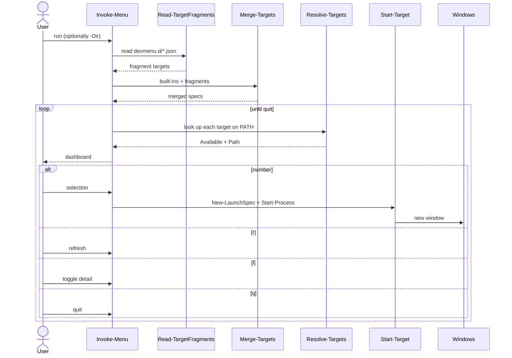
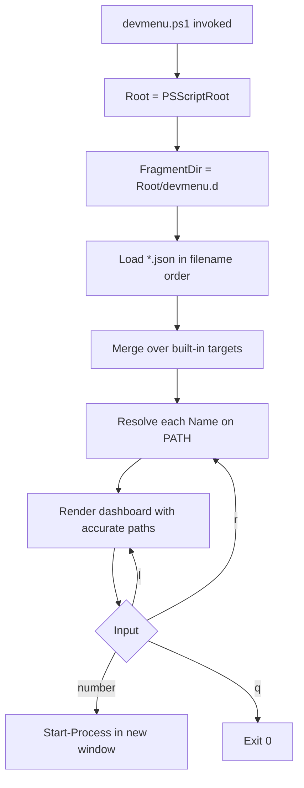
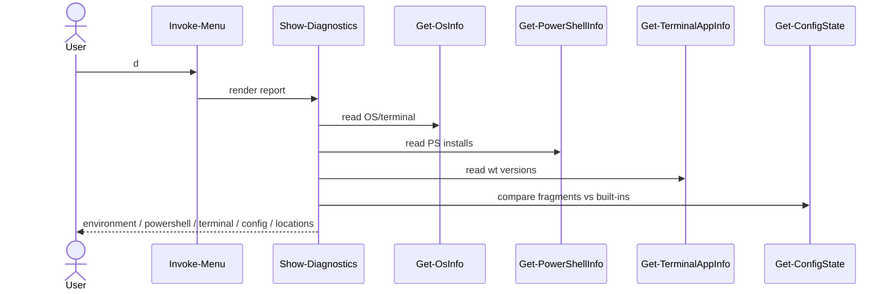

# devmenu architecture

`devmenu.ps1` is a single portable script. It resolves everything from
`$PSScriptRoot`, so it behaves the same wherever it is installed. The pieces are
pure functions (fragments → merge → resolve) wrapped by one interactive loop.

## Components

```mermaid
classDiagram
    class Invoke_Menu {
        +string Dir
        +string Root
        +scriptblock Lookup
        +object[] Defaults
        +string[] FragmentPaths
        -bool showDetail
        +run() int
    }
    class Read_TargetFragments {
        +string[] Paths
        +object[] run()
    }
    class Merge_Targets {
        +object[] Defaults
        +object[] Fragments
        +object[] run()
    }
    class Resolve_Targets {
        +object[] Targets
        +scriptblock Lookup
        +object[] run()
    }
    class New_LaunchSpec {
        +string Name
        +string[] Arguments
        +string Dir
        +hashtable run()
    }
    class Start_Target {
        +hashtable Spec
        +run()
    }
    class Show_Dashboard {
        +object[] Targets
        +string Dir
        +string Root
        +switch ShowDetail
        +run()
    }
    class Get_ScriptRoot {
        +string run()
    }
    class Get_OsInfo {
        +object run()
    }
    class Get_PowerShellInfo {
        +object run()
    }
    class Get_TerminalAppInfo {
        +object run()
    }
    class Get_ConfigState {
        +object[] Defaults
        +string[] FragmentPaths
        +object run()
    }
    class Get_Locations {
        +string Root
        +string FragmentDir
        +string[] FragmentPaths
        +object run()
    }
    class Show_Diagnostics {
        +object[] Defaults
        +string Root
        +string FragmentDir
        +string[] FragmentPaths
        +run()
    }

    Invoke_Menu --> Read_TargetFragments : loads
    Invoke_Menu --> Merge_Targets : merges
    Invoke_Menu --> Resolve_Targets : resolves
    Invoke_Menu --> Show_Dashboard : renders
    Invoke_Menu --> New_LaunchSpec : builds
    Invoke_Menu --> Show_Diagnostics : reports on 'd'
    New_LaunchSpec --> Start_Target : starts
    Invoke_Menu --> Get_ScriptRoot : roots paths
    Show_Diagnostics --> Get_OsInfo
    Show_Diagnostics --> Get_PowerShellInfo
    Show_Diagnostics --> Get_TerminalAppInfo
    Show_Diagnostics --> Get_ConfigState
    Show_Diagnostics --> Get_Locations
    Get_ConfigState --> Read_TargetFragments
    Get_ConfigState --> Merge_Targets
    Start_Target --> "OS process" : Start-Process
```

`Target` records flow between the stages:

| Stage | Produces |
| --- | --- |
| `Read-TargetFragments` | `{ Name, Arguments, Enabled, Source }` |
| `Merge-Targets` | enabled specs, wins by `Name` over built-ins |
| `Resolve-Targets` | `{ Name, Arguments, Available, Path, Source }` |
| `New-LaunchSpec` | `hashtable` ready for `Start-Process @Spec` |

## Interaction sequence



## Location independence



No stage reads the current directory for its own files; the current directory is
only used as the default working directory for launched processes.

## Detection sources

`Get-Diagnostics` (rendered by `Show-Diagnostics`) gathers, without launching
anything:

| Detector | Source |
| --- | --- |
| `Get-OsInfo` | `HKLM:\SOFTWARE\Microsoft\Windows NT\CurrentVersion`, `OSVersion`, runtime architecture, `WT_SESSION` |
| `Get-PowerShellInfo` | `$PSVersionTable`, `Get-Process -Id $PID`, `Get-Command -All` for `pwsh`/`pwsh-preview`/`powershell` |
| `Get-TerminalAppInfo` | `Get-Command wt`, AppModel `Repository\Packages` key names for stable/canary versions |
| `Get-ConfigState` | fragment files via `Read-TargetFragments` + `Merge-Targets` versus built-ins |
| `Get-Locations` | `$PSCommandPath`/`$PSScriptRoot` and known paths relative to the root |


